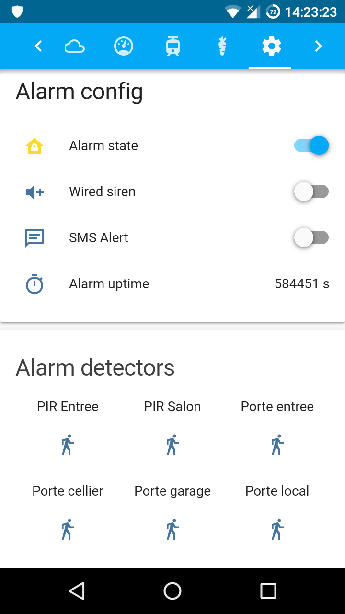
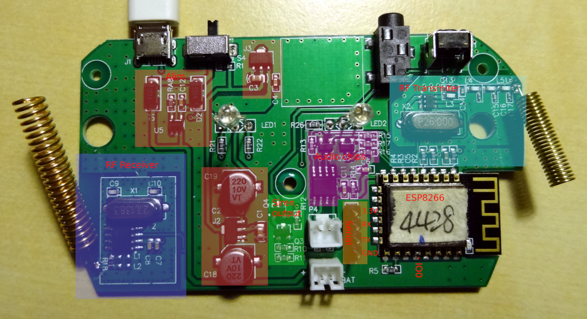

# WOFEA V10 Hack
## Objective
[WOFEA V10 Wifi](https://wofea.fr.aliexpress.com/store/group/V10-Wifi-alarm/902213_513571047.html?spm=a2g0w.12010612.0.0.19cf6442fpjjrc) is a chinese low cost alarm system based on ESP8266.
Objective of this project is to create a custom and open source firmware based on [esphome](https://esphome.io/) and [Home Assistant](https://www.home-assistant.io/) ! 



## Hardware
- WOFEA V10 Base:
    - ESP8266 4M
    - 433Mhz RF transmiter & receiver
    - 2 status Leds
    - Audio ouput & HP
    - Internal Siren 5V output
    - Battery pin
- PIR & contact sensor :
    - 433Mhz transmiter with unique code
    - Detection = send 10 frame of 24bits
    - PIR pulse lenght : 385 us
    - Contact sensor pulse lenght : 433 us
- External siren :
    - 433Mhz receiver only
    - 3 codes : arm, disarm, siren
- Remote control :
    - 433Mhz transmiter
    - 4 codes : arm, disarm, siren, ?
    - pulse lenght : 325 us

## Internal ESP8266 Pin


- GPIO5 : RF receiver
- GPIO4 : RF transmiter
- GPIO0 : Status led 2 (RED)
- GPIO2 & GPIO15 : Status led 1 (RED/BLUE)
- GPIO3 : Siren ouput
- GPIO16 : Reset button
- GPIO14, GPIO12, GPIO13 : Audio output (probably I2S protocol or pwm audio)

Wofea board :


## Extract original firmware
- Solder serial connector (see picture)
- Connect GND on IO0 (boot loader mode)
- Turn device on (with usb power)
- Run : 
    > esptool read_flash 0x00000 0x400000 firmware.bin
- Dont use crappy usb to serial like [Prolific PL2303HX](https://vilimpoc.org/blog/.../esptool-usb-serial-adapter-shootout/)

## Flash ESPHOME firmware
- Solder serial connector (see picture)
- Connect GND on IO0 (boot loader mode)
- Turn device on (with usb power)
- Run : 
    > esphome alarm.yaml run
- Add to [Home assitant](https://www.home-assistant.io/components/esphome/)
- Enjoy

## Current ESPHOME support
- [x] Status leds 
- [x] Reset button
- [x] Siren ouput
- [x] RF receiver
- [X] RF transmiter
    - Chip is CMT2110A (HopeRf or cmostek)
- [x] Support alarm automation
- [x] SMS Alert
- [ ] RF jamming detection
- [ ] Support audio output

## Add backup battery
- Pin charge is ~4.66v
- Find compatible battery : TODO

## Install Home Assitant on OrangePi lite
- Download Debian image : https://www.armbian.com/orange-pi-lite/
- Write on SD card
- Default password is root / 1234

```sh
# Configure Wifi
armbian-config

# Install missing packets
apt-get install jq avahi-daemon dbus apparmor-utils

# Install Docker-CE
curl -sSL https://get.docker.com | sh

# Install Hass.io (H3 is equivalent to RPI2)
curl -sL https://raw.githubusercontent.com/home-assistant/hassio-build/master/install/hassio_install | bash -s -- -m raspberrypi2

# Protect sd card
vi /etc/fstab
# add : commit=5,data=journal

# Open url : http://orangepilite:8123
```
